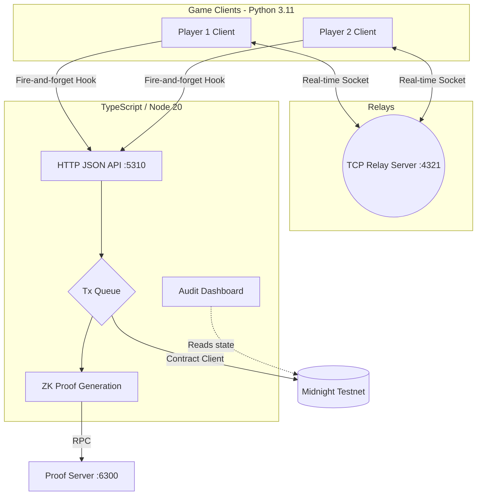

<div align="center">

# 🚀 Among Midnight
**The world's first Zero-Knowledge Multiplayer Deduction Game**

[](https://midnight.network/)
[](#)
[](https://www.python.org/)

*A next-generation blockchain game built on the Midnight Network.*

</div>

---

## 🌟 The Future of Trustless Gaming
In traditional centralized multiplayer deduction games, the server holds all the secrets and literally dictates the game. In fact, many standard implementations assign roles in highly predictable or manipulated ways! Every centralized game faces this dilemma—you just have to blindly trust the server. 

**Welcome to the future.** We built **Shadow Protocol**, a zero-knowledge cryptographic fairness and anti-cheat layer powered by the **Midnight Network**, directly into the core engine of Among Midnight. 
With **real-time gameplay**, the game binds the role deal, every kill, every vote, and every ejection to zero-knowledge commitments on the blockchain. 
The game runs flawlessly, but **it can no longer lie about it**. 

### Why this changes everything:
- 🚫 **No more rigged servers:** Role assignments are verifiable through a deterministic Fisher–Yates shuffle via an on-chain committed seed.
- 🔒 **Cryptographic proofs for actions:** Kills are bound to a ZK circuit—an innocent agent literally *cannot* forge a kill because they cannot prove they hold the Saboteur role.
- ⛓️ **Immutable Audit Trail:** At game over, an on-chain reveal lets anyone fully audit the entire match. No rewritten histories, no cheating.

---

## 🏗️ Technical Architecture & Integration

Our architecture seamlessly integrates a real-time Python game client with the Midnight blockchain via a dedicated TypeScript bridge, maintaining instant gameplay speeds.



### Deep Dive into the Integration:
* **The Bridge (`midnight-bridge`):** Handles serialized tx queues, retries, and talks to the ZK Proof generation server, anchoring state to the `ShadowLedger` compact contract.
* **Hooks (`midnight_hooks.py`):** Acts as the bridge between real-time game loops and asynchronous blockchain state without blocking the UI.
* **Compact Contract:** Evaluates ZK circuits for Nullifier checks (preventing double votes) and phase guards.

---

## 🎮 Game Features

- **Local Multiplayer LAN:** Support for 5 players (Spec-locked: 1 Saboteur + 4 Agents).
- **Fully functional Voice Chat**
- **Zero-Knowledge Fairness Layer:** 
  - On-chain committed role dealing.
  - Provable actions (Kills, Votes, Ejects).
- **Classic Gameplay Loop:** Sabotage reactor/lights, vent traversal, task completion, and emergency meetings!

---

## 📸 Screenshots

| Menu | Gameplay | Tasks |
|:---:|:---:|:---:|
|  |  |  |
|  |  |  |

---

## 🚀 Quickstart

### Prerequisites
- Python 3.11 (3.12 removed `asyncore`)
- Node.js 20+
- `pygame`, `pytmx`, `pyaudio`

### 1. Start the Midnight Bridge (Mock Mode)
*Run this in terminal 1:*
```bash
cd midnight-bridge
npm install
npm run dev
```
The bridge boots on `http://127.0.0.1:5310`. Open the ZK audit dashboard at `http://127.0.0.1:5310/audit`.

### 2. Start the Game Server
*Run this in terminal 2:*
```bash
python3.11 -m venv .venv
source .venv/bin/activate  # or .venv\Scripts\activate on Windows
pip install -r requirements.txt
python server.py 
```

### 3. Launch Clients
*Run this in terminal 3, 4, 5... (for each player):*
```bash
python main.py
```
Choose 'Local' and connect to `127.0.0.1`. The match will auto-deal roles securely on-chain once 5 players join!

*(See [SHADOW_PROTOCOL.md](SHADOW_PROTOCOL.md) for full Midnight Testnet deployment instructions and Phase 2 config).*

---

## ⌨️ Controls

- **Move:** `W` `A` `S` `D` or Arrow Keys
- **Interact / Task / Vent:** `Space`
- **Kill:** `Enter`
- **Sabotage Lights:** `Ctrl` (Fix at Electrical)
- **Sabotage Reactor:** `Shift` (Fix at Reactor)
- **Map:** `Tab`
- **Mouse:** Left-click to complete tasks and vote.

---

## 👨‍💻 Created By
**Ayush Kumar**
- GitHub: [@ayushkumar](https://github.com/ayushkumar)

*Built from scratch for the Midnight Network Hackathon.*
